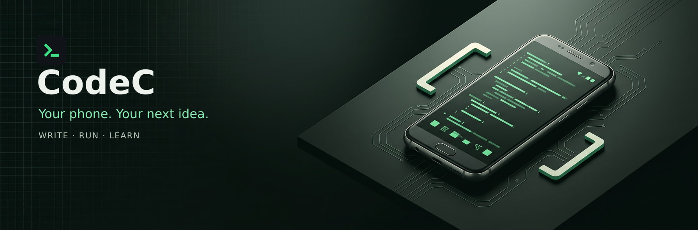

<p align="center">
  
</p>

<h1 align="center">CodeC IDE</h1>

<p align="center">
  <strong>A real coding workspace. On your Android phone.</strong><br>
  Write C offline. Work with projects and a terminal. Preview the web.<br>
  Add Python, JavaScript and optional AI when you need them.
</p>

<p align="center">
  <a href="https://github.com/pabi277/CodeC/releases"><strong>Download the APK</strong></a> ·
  <a href="#quick-start">Quick start</a> ·
  <a href="#learn-and-explore">Learn</a> ·
  <a href="docs/guides/AI.md">AI guide</a> ·
  <a href="https://github.com/pabi277/CodeC/issues">Report an issue</a>
</p>

<p align="center">
  <strong>Android 7+ minimum</strong> &nbsp; / &nbsp;
  <strong>Free to download</strong> &nbsp; / &nbsp;
  <strong>Source on GitHub</strong> &nbsp; / &nbsp;
  <strong>Beta</strong>
</p>

<p align="center"><sub>Custom AI-generated illustrations on this page are conceptual artwork—not screenshots of the app.</sub></p>

---

## Built for the work you can do today

CodeC brings an editor, compiler, terminal and project tools into one Android app. Start with a small C program, explore a web project, or build your own command-line workflow—without needing an AI account to get started.

**C works offline with the bundled TCC compiler on arm64-v8a and x86_64 devices.** Optional Linux tools and additional runtimes need setup and downloads. The universal APK supports installation across multiple ABIs, but that does **not** mean the bundled C compiler runs on every architecture. See [device limitations](docs/guides/BETA.md).

| Write with less friction | Build beyond a single file |
|---|---|
| **A capable editor** — tabs, autosave, find/replace, formatting, diagnostics, TextMate highlighting, snippets and Emmet. | **Projects that stay yours** — create a project, clone a Git repository or import a ZIP. Work with a file tree or individual files. |
| **Offline C** — bundled TCC on supported 64-bit devices; automatic compiler selection, not a settings puzzle. | **A real terminal** — VT/ANSI sessions, extra keys, keyboard shortcuts and optional Linux tools from CodeC’s signed repository. |
| **Local web preview** — serve a whole HTML/CSS/JS project locally, inspect its console and reload on save. | **Git with clear status** — stage, commit, manage branches and push. A local commit is never presented as a successful upload. |

**Your workspace:** Projects → Editor → Terminal → Packages → Settings.

<details>
<summary><strong>More of the everyday details</strong></summary>

- Your phone keyboard is the default; CodeC Keys is optional. **Tab** accepts a suggestion; **Enter** inserts a newline.
- TextMate highlighting and bundled snippets cover many file types. Syntax support does not mean every language runtime is installed.
- Returning launches resume your last file. The editor keeps the caret visible when its available space changes.
- The Projects **+** menu offers New Project, Clone Git Repo and Import ZIP. The old Open Folder action is no longer part of this workflow.
- Project **⋮ → Open in editor** opens the whole project; tapping a file opens that file.
- Generated run artifacts are kept separate from source. Explicitly named compiler outputs stay where you request them; repository-local Git exclusions respect your `.gitignore`.
- Web Preview supports relative assets, local `fetch()` and ES modules. LAN sharing is opt-in; other devices on that network may be able to access the served files.
- Back navigation respects open menus, project trees and web-page history before leaving the current context.

</details>

## Download and update

### For everyday use

1. Open [GitHub Releases](https://github.com/pabi277/CodeC/releases) and choose the newest **CodeC app release**, tagged `app-v…`.
2. Download **`CodeC-IDE-<version>-universal.apk`**. There is one universal release APK—no ABI guessing.
3. Check the release’s SHA-256 value if desired, allow Android’s **Install unknown apps** permission for your download source, then install.

The published [v1.3.18 release](https://github.com/pabi277/CodeC/releases/tag/app-v1.3.18) is **7.22 MB** (7,217,532 bytes), versionCode **22**. Check Releases for newer versions rather than treating this snapshot as an automatic update check.

In CodeC, **Settings → About → Check for updates** checks the app release channel, compares versions and verifies the published checksum before installation. A `userland-*` release is Linux setup data, **not** the CodeC app.

### Release or debug—which should you install?

| Download | Intended use | Update compatibility |
|---|---|---|
| `CodeC-IDE-release` Actions artifact / universal release APK | Normal app use and release testing | Uses the configured release signing key. Keep the same signing identity for updates. |
| `CodeC-IDE-debug` Actions artifact / `*-universal-debug.apk` | Development and debugging | Uses the repository’s pinned debug key; it is a different signing channel. |

> **Protect your projects:** debug and release are not interchangeable update channels. If Android rejects an update, check the APK/channel first—do not immediately uninstall. Export valuable projects before any reinstall or channel change. Keep signing keys and passwords private; never include them in a bug report.

Developer builds are under [Actions → Build APK → Artifacts](https://github.com/pabi277/CodeC/actions/workflows/build-apk.yml). A normal branch push builds artifacts; it does **not** publish an app release. Publishing is gated to the `app-v*` release flow with version/signing checks.

## Quick start

### 1 · Open your workspace

On a fresh install, you can skip the educational introduction, then acknowledge the privacy summary. CodeC opens an editable **Arcade** web project with Snake, Block Party and Tic-Tac-Toe. Run it, inspect its files, or create your own project instead. This is not a mandatory coding exercise.

### 2 · Write a small C program

Create a C project from **Projects → + → New Project**, then open `main.c`:

```c
#include <stdio.h>

int main(void) {
    puts("Hello from CodeC!");
    puts("Made on my phone.");
    return 0;
}
```

Tap **RUN**. On a supported built-in-TCC device, this example needs no compiler download.

Expected output:

```
Hello from CodeC!
Made on my phone.
```

### 3 · Try the terminal workflow

From the folder containing `main.c` in **CodeC Terminal**, run one command at a time:

```sh
cc main.c -o hello
./hello
```

The `./` matters: the current directory is deliberately **not** on `PATH`. For the course’s interactive `scanf` exercises, use Terminal so you can type answers and inspect the complete session. CodeC also has interactive run/input paths; it is not accurate to say every editor RUN lacks input support.

<p align="center">
  
  <br><sub>Write → compile → inspect. Conceptual artwork, not application UI.</sub>
</p>

## Add tools when you need them

CodeC does **not** download the Linux environment on first launch. Built-in C on supported ABIs and local static HTML preview are available without it. Start the optional setup from Terminal when you need package tools or another runtime; progress and recovery stay in that flow without locking the rest of the editor.

| What you want to run | What it needs |
|---|---|
| C | Bundled TCC on arm64-v8a/x86_64; compatible toolchain or fallback on other setups. |
| C++ / a Clang toolchain | Optional Clang module, subject to architecture and Android execution restrictions. |
| Python | Optional Linux setup and the `python` package; command: `python3`. |
| JavaScript outside a web page | Optional Linux setup and `nodejs`; command: `node`. |
| HTML, CSS and browser JavaScript | A local web project. Open `index.html` and tap RUN. |

Once Linux setup is complete, examples in **CodeC Terminal** include:

```sh
pkg install python
pkg install nodejs
pkg install git
```

The **Packages** tab also provides install/run controls and command tools. CodeC uses its own signed package metadata and app-specific prefix. **Do not add official Termux repositories, mix their installed packages into CodeC, replace `cc` with a Clang symlink, or put `.` on `PATH`.**

### CodeC and Termux

CodeC is an integrated Android IDE; Termux is a terminal-first Linux environment. They are separate projects, not interchangeable package installations. CodeC can use a compatible Termux Clang setup as an **automatic fallback** when needed. There is no manual compiler-engine picker.

Read the [CodeC/Termux comparison](website/guides/codec-vs-termux.html) or the [compiler guide](website/guides/engines.html) for the workflow and architecture differences. These links open checked-in website source; the website is not yet publicly deployed.

<details>
<summary><strong>Set up optional Termux fallback—only if CodeC asks for it</strong></summary>

Use a compatible **Termux 0.109+** installation from the sources listed in the [official Termux project](https://github.com/termux/termux-app#installation), such as its [GitHub releases](https://github.com/termux/termux-app/releases) or [F-Droid package](https://f-droid.org/packages/com.termux/). Follow the Output Panel’s guidance when fallback is needed.

Run these commands in **Termux itself**, **not CodeC**:

```sh
echo "allow-external-apps=true" >> ~/.termux/termux.properties
termux-reload-settings
pkg update && pkg install clang
```

Then allow **Run commands in Termux environment** for CodeC in Android’s app permissions. Labels vary by device. Retry the build; CodeC chooses the available engine automatically.

The bundled TCC covers arm64-v8a and x86_64. The optional Clang module’s arm64 build is not an x86 compiler. Never assume that a universal APK gives every device the same available toolchains.

</details>

## Optional AI. Your key. Your approval.

Use AI for explanations, focused questions and small, reviewable code changes—not as a prerequisite for writing or running a program.

- **Bring your own key.** Gemini is the default provider. NVIDIA Build is a manual dev/test option, not a production recommendation. CodeC provides no shared key, model-hosting service or remote proxy.
- **Preview before sending.** You choose the provider and inspect the request. Sending a project task can authorize bounded, filtered read-only follow-ups without a new tap for each file read.
- **Review before changing anything.** Edits arrive as proposals. Files change only through your **Apply** action; a requested run needs its own **Run** approval. The assistant has no direct write or execution tool.
- **Know what is retained.** Raw chat history is session-only. Separate bounded task-memory/undo stores are not chat transcripts. Provider retention is governed by the provider’s terms—not a promise that nothing is stored remotely.
- **Your key, your bill.** Provider usage, limits and charges remain yours. Keys are encrypted through Android Keystore and excluded from app backups.

<details>
<summary><strong>Tool boundaries and hard limits</strong></summary>

The eight tools are `list_files`, `search_project`, `read_file`, `read_files`, `find_files`, `outline_file`, `read_run_output` and `request_run`. The last one requests approval; it does not execute a command itself.

Task ceilings include **12 model turns**, **24 tool calls**, **2 approved runs**, **24,000 read characters**, **8,000 characters per tool result** and **8 files per batch**. AI controls operate inside those ceilings. Secret-like paths, Git internals, build output and symlink escapes are filtered; inspect the request and results rather than assuming a filter is infallible.

There is no shipped autonomous agent or on-device/local-model feature implied here.

</details>

**Read before enabling:** [AI guide](docs/guides/AI.md) · [Data and privacy](docs/guides/DATA_AND_PRIVACY.md).

## Privacy and your work

- No ads, analytics, tracking SDK or automatic crash-report uploads.
- Network actions include the package, Git, update, AI and sharing workflows you choose. **“Your code never leaves the device” would be an inaccurate promise.**
- Shared-storage access requires Android permission; that grant can allow subsequent file access without asking again for each file.
- Projects live in app-private storage by default. Export important work outside the app before uninstalling or changing signing channels.
- Project backup/export is not a backup of the entire Linux environment, installed packages, settings or credentials.
- LAN sharing is opt-in. Serve only files you intend other network users to access.

Read the full [permissions and data guide](docs/guides/DATA_AND_PRIVACY.md) and [backup/beta guidance](docs/guides/BETA.md).

## Learn and explore

The **19-chapter CodeC course** covers a first C program, terminal basics, the editor, shell scripting, Python, Git, web projects, device APIs and optional AI. Examples are included locally; you do not need an AI subscription to follow the course.

**[Download the complete website and course ZIP](https://raw.githubusercontent.com/pabi277/CodeC/0715ab88c9f92f0d02439e1bed38d49e6b039831/web_docs/chat-web7/CodeC-website-organized-SEO.zip)** → import it as a **new CodeC project** → keep its folders → open root `index.html` → RUN.

The website is currently available as this offline package and [checked-in source](website/), **not a public deployment**. Its planned GitHub Pages address is not presented as a live documentation site. Course redistribution terms remain a separate owner decision; this README grants no new course-content license.

| Looking for… | Start here |
|---|---|
| Help with a compiler, terminal or setup issue | [Troubleshooting](docs/guides/TROUBLESHOOTING.md) |
| Known limitations and reporting guidance | [Beta guide](docs/guides/BETA.md) |
| Optional AI setup, tools and limits | [AI guide](docs/guides/AI.md) |
| Permissions, network use and retained data | [Data and privacy](docs/guides/DATA_AND_PRIVACY.md) |
| What changed between releases | [Release notes](docs/guides/RELEASE_NOTES.md) |
| Project documentation and development history | [Documentation index](docs/README.md) · [Journey](docs/journal/JOURNEY.md) |

## Troubleshooting essentials

| What you see | First thing to check |
|---|---|
| APK will not update the installed app | Release versus debug signing channel, version and download integrity. Export first; do not start with an uninstall. |
| `Permission denied` or `Exec format error` | The selected toolchain’s ABI and Android execution restrictions. Follow Output Panel remediation; there is no engine picker to switch. |
| Missing runtime or package | Complete the optional setup if needed, then check the package’s actual installation result. |
| A program appears to wait forever | Check whether it is waiting for input. Use Terminal for the interactive lesson workflow and inspect the actual output/exit status. |
| A long-running job stops in the background | Android battery/background restrictions and the foreground notification. Device behavior varies. |
| `cc --version` prints a version then complains about `main` | The current `cc` frontend still adds link objects for this probe. This alone does not mean a normal source compilation failed. |

CodeC is in **beta**. Android 7 is the declared minimum, not certification that every Android 7 device, emulator or 32-bit tablet works. Keep useful backups and include your exact environment when reporting an issue.

<details>
<summary><strong>Send a useful, safe bug report</strong></summary>

Open [GitHub Issues](https://github.com/pabi277/CodeC/issues) with:

- CodeC version/build from About, Android version and device/ABI if known.
- The smallest steps and source example that reproduce the problem.
- Expected behavior, actual output and exit/error text.
- A screenshot when a layout or keyboard problem is involved.

Remove private source, API keys, GitHub tokens, signing passwords and keystore material. Review logs before sharing them. Personal contact options, where available, stay in the app’s Feedback & Support section—not this public README.

</details>

## Build and contribute

Use **JDK 17**, the project-pinned Android SDK/NDK/CMake configuration, and the checked-in Gradle wrapper. Android Studio can open the repository directly.

```sh
./gradlew :app:assembleDebug
```

Debug APK output: `app/build/outputs/apk/debug/`. The wrapper pins **Gradle 9.3.1**; do not substitute an arbitrary system Gradle. CI is defined in [Build APK](.github/workflows/build-apk.yml).

Release builds use the existing private upload key and configured environment variables. **Do not generate a new key merely to rebuild an APK.** Signing keys/passwords never belong in Git or chat. [Signing guidance](docs/guides/UPLOAD_KEY_SETUP.md) includes historical setup/recovery notes; preserve the current signing identity for normal updates.

<details>
<summary><strong>Repository map and contributor rules</strong></summary>

| Path | Purpose |
|---|---|
| `app/` | Android application |
| `codec-packages/` | CodeC package recipes, repository tooling and public trust material |
| `docs/` | App guides, source-backed decisions and implementation history |
| `website/` | Self-contained HTML/CSS product site and course |
| `web_docs/` | Website plans, checks, device evidence and downloadable snapshots |
| `assets/readme/` | Optimized README illustrations and provenance |
| `scripts/` | Build, verification and maintenance helpers |

Start with [rule.md](rule.md). App handoff: [prompt.md](prompt.md). Website handoff: [web_prompt.md](web_prompt.md).

**Owner approval is required before creating a PR or merging.** Agents work only on their assigned session branch; committing/pushing that branch does not authorize a merge, release or deployment. Work begins from an owner-reported issue or requested change, not an automatically resumed phase plan.

Preserve signed package metadata, CodeC’s `cc` TCC frontend, the real shell binaries and private signing material. Keep the `-o <output>` pair last in course compiler commands. Do not put `.` on `PATH`, import official Termux packages into CodeC, or use `build-package.sh -I`. Agent-side Android/Gradle testing belongs in the existing CI workflow; device acceptance must come from actual owner reports.

For the UI’s historical design context, see the [Phase 64 handoff](docs/phases/09-onboarding-setup/chat-phase64/HANDOFF.md), [UI review](docs/journal/UI_POLISH_REVIEW_20260927.md) and [first-run research](docs/research/FIRST_RUN_EXPERIENCE_RESEARCH_20260930.md). These records are history, not permission to restart completed work.

</details>

---

<p align="center">
  <strong>Small screen. Real possibilities.</strong><br>
  <a href="https://github.com/pabi277/CodeC/releases">Get CodeC</a> ·
  <a href="https://github.com/pabi277/CodeC/issues">Share feedback</a> ·
  <a href="docs/guides/DATA_AND_PRIVACY.md">Read the privacy guide</a>
</p>
