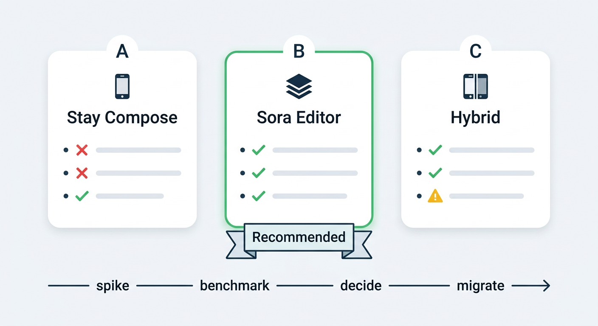
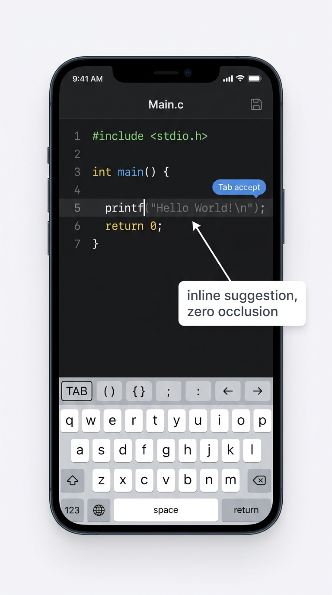
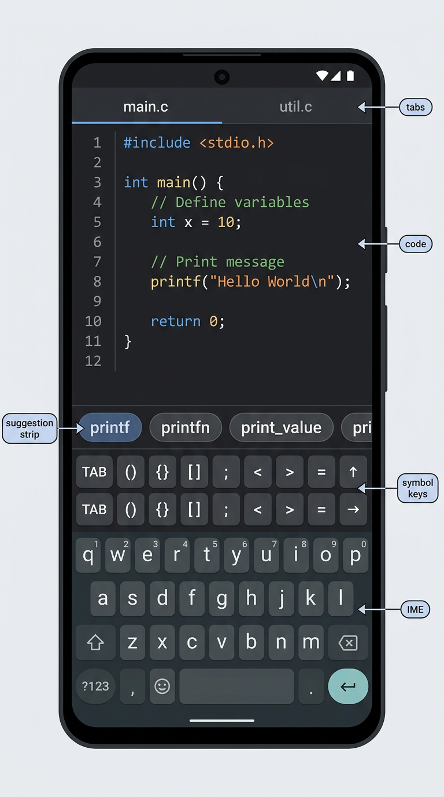

# CodeC — Mobile Editor & Typing Experience: Research Dossier

> **Status:** 📋 **RESEARCH COMPLETE — NO CODE WRITTEN.** Owner brief
> (2026-09-04, this chat): *"the main problem is the editor … find all GitHub /
> other open source to find the best optimized phone editor and also good typing
> experience … the suggestions are good but also problematic for phone because it
> suggests and can't do anything … find sources like spck, coding c etc … just
> make it best."*
>
> **This chat changed no code.** Everything below is research + new phase
> planning docs; implementation waits for the owner's explicit "Start Phase N".
>
> Standing law respected: clean-room (replicate *features*, never copy code —
> Spck `io.spck` and Coding C `com.kvassyu.coding2.c` are closed source; Termux /
> AndroidIDE / Xed-Editor / Cosmic-Ide / Unexpected-Keyboard are **GPL-3.0** =
> behavior/feature-list reference only), phone-first, no PR/merge without the
> owner's command (`rule.md`, `README.md`).

---

## 1. Why CodeC's editor needs a dedicated round

Facts grounded in the current code (`app/src/main/java/com/codeci/ide/`):

| Layer | Today | Known limit |
|---|---|---|
| Text widget | One `BasicTextField` (`EditorScreen.kt`) with `visualTransformation = SyntaxVisualTransformation(...)` | **Compose `BasicTextField` is not lazy; layout cost scales with span count** — JetBrains [compose-multiplatform#4023](https://github.com/JetBrains/compose-multiplatform/issues/4023) (CMP-4023, closed **WONTFIX**). `TextLayoutResult#getLineForOffset` is a linear scan ([#4021](https://github.com/JetBrains/compose-multiplatform/issues/4021)). |
| Highlighting | `SyntaxVisualTransformation` (`ui/utils/MultiLanguageSyntaxHighlighter.kt`) | Phase 22.1 already windowed spans to ±3 000 chars around the caret — it mitigates but can't remove the ceiling. |
| Completion | `CodeCompletionEngine.completions(...)` (`ui/editor/CodeCompletionEngine.kt`), `produceState` + 120 ms debounce off-main-thread (Phase 22.1); floating popup anchored near the caret (`EditorScreen.kt` ~L1451) | Popup **occludes the code it is completing**; accept paths are TAB/ENTER via the Phase 22.2 IME strip or tiny item taps; on a soft-only keyboard there is no Tab key under a thumb. |
| Extra keys | `EditorKeySet` (TAB, `()` `{}` `[]` pairs, arrows…) + context swap to `RunKeySet` while an interactive run waits for input | Keys are tap-only (tap → insert). No long-press popups, no swipe layers, not user-editable. |
| Selection / caret | System handles + arrows; pinch zoom (`FontSizeZoom`) | No magnifier, no double-tap-word-drag, no fast scroller documented for code. |
| Deferred from Phase 22 | *"the `TextFieldValue` → `TextFieldState` / `bigtext`-style rewrite — the only way past the `BasicTextField` layout ceiling, and **its own phase**"* (`docs/NEXT_STEPS.md`) | **This dossier is the research for that deferred item — it becomes Phase 25.** |

The two owner complaints decompose cleanly:

1. **"Suggestions are good but can't do anything on phone"** → a completion-UX
   design problem (occlusion + no thumb-reachable accept key), not an
   engine-quality problem. Fixed by Phase 27 (§6).
2. **"Best optimized phone editor + good typing experience"** → a foundation
   problem (BasicTextField ceiling) and a keyboard-synergy problem. Fixed by
   Phase 25 (§5) and Phase 26 (§7).

---

## 2. Open-source survey (GitHub-verified, 2026-09-04)

Stars/license/activity pulled from the GitHub API on 2026-09-04; "teaches CodeC"
is the *feature-level* lesson, per the clean-room law.

| Project | ★ | License | Alive? | What it is | What it teaches CodeC |
|---|---|---|---|---|---|
| **[Rosemoe/sora-editor](https://github.com/Rosemoe/sora-editor)** | 1.4k | **LGPL-2.1** | ✅ pushed 2026-09-03, v0.23.6 on Maven | The de-facto Android code-editor **view library** | Everything — see §4. The industry answer to "best optimized phone editor". |
| **[massivemadness/Squircle-CE](https://github.com/massivemadness/Squircle-CE)** | 1.9k | **Apache-2.0** | ✅ 2025.1.3, F-Droid | Phone code editor + file manager on Sora | **Safest study target** (Apache-2.0). Extended keyboard, auto-pairs that *skip over* the closing char, sticky scroll, unlimited undo/redo across restarts ([F-Droid listing](https://f-droid.org/en/packages/com.blacksquircle.ui/)). |
| **[AndroidIDEOfficial/AndroidIDE](https://github.com/AndroidIDEOfficial/AndroidIDE)** | 3.1k | GPL-3.0 | ⏸ archived 2024-10 | Full Android IDE on phones (built on Sora) | LSP-grade completion on a phone *is possible*; symbol input row; horizontal/vertical editor-actions window; auto-trigger completion after attribute insert ([release notes](https://androidrepo.com/repo/itsaky-AndroidIDE)). |
| **[Xed-Editor/Xed-Editor](https://github.com/Xed-Editor/Xed-Editor)** | 2.3k | GPL-3.0 | ✅ pushed 2026-09-03 | Advanced editor, Sora fork (`soraX`), plugin SDK | Proof Sora withstood daily-phone use + theming/extensions at scale. |
| **[deadlyjack/Acode](https://github.com/deadlyjack/acode)** | 6.8k | MIT | ✅ very active | Editor on **Ace (WebView)** core; symbol row above keyboard | Alternative architecture (web core) works but costs a WebView; Ace's mobile autocomplete is tap-oriented. CodeC's native path is already stronger. |
| **[termux/termux-app](https://github.com/termux/termux-app)** | 60k+ | GPL-3.0 | ✅ | Terminal; **extra-keys** two-row key bar | The `extra-keys` config DSL: `{key: 'UP', popup: 'PGUP'}` — **a keycap with a long-press popup variant** doubles key density without new rows (behavior reference; the view was even moved to `termux-shared` v0.118 for reuse by *GPL apps only*). |
| **[Julow/Unexpected-Keyboard](https://github.com/Julow/Unexpected-Keyboard)** | 3.2k | GPL-3.0 | ✅ | IME where keys enter 4 symbols by swiping | Users explicitly recommend it *for coding* ([r/androidapps](https://www.reddit.com/r/androidapps/comments/1on1964/good_app_for_coding/)). Lesson: **symbol density via swipe-on-key beats extra rows** — applies to CodeC's key strip too. |
| **[klausw/hackerskeyboard](https://github.com/klausw/hackerskeyboard)** | 2.4k | Apache-2.0 | ⚠️ stale but installed widely | Full 5-row PC keyboard IME | Still the fallback "real Tab/arrows" IME; CodeC's keyboard-guide part (Phase 26.3) points here. |
| **[florisboard/florisboard](https://github.com/florisboard/florisboard)** | 8.6k | Apache-2.0 | ✅ beta | Privacy keyboard w/ gesture rows | Modern IME gesture vocabulary (space-slider caret move, backspace swipe-to-delete-word). |
| **[Cosmic-Ide/Cosmic-Ide](https://github.com/Cosmic-Ide/Cosmic-Ide)** | 724 | GPL-3.0 | ✅ | JVM IDE on phone (Sora-based) | Second large-scale Sora consumer; IDE features language-lesson parity. |
| **[tyron12233/CodeAssist](https://github.com/tyron12233/CodeAssist)** | 1.8k | GPL-3.0 | ⏸ | AIDE-like builder app | Proof of smali/dex-era phone IDE UX; reference only. |
| **[Qawaz/compose-code-editor](https://github.com/Qawaz/compose-code-editor)** | small | — | ⏸ | Compose highlighting editor | **Negative proof**: same `BasicTextField + parse-to-AnnotatedString-per-keystroke` pattern CodeC already outgrew. Doubling down on pure-Compose editing has no exemplar that scales. |
| **[kaleidot725/text-editor-compose](https://github.com/kaleidot725/text-editor-compose)** | 32 | MIT | ⏸ 2022-era | Compose line-list editor | Same conclusion: Compose-native editors stay toy-scale. |
| **[MuntashirAkon/TextWarrior](https://github.com/MuntashirAkon/TextWarrior)** | 12 | other | ⏸ | Classic Android code editor | README says it all: *"DISCONTINUED in favour of Sora-Editor"*. |
| **Spck** (`io.spck`) | — | **closed** | ✅ | Web-projects editor w/ Git | Behavior reference (as always): per-language key modes, custom snippets tab, completion for web tech; small and fast ([reviews](https://blog.founders.illinois.edu/best-android-text-editor-for-programming/), [slant](https://www.slant.co/topics/1662/~best-code-editors-for-android)). |
| **Coding C** (`com.kvassyu.coding2.c`) | — | **closed** | ✅ | C IDE w/ built-in compiler (TCC-style — CodeC's origin model) | Behavior reference: symbol bar + run-loop simplicity is the benchmark the owner compares CodeC against. |

**Survey verdict:** everyone serious about a *native* Android phone editor
converged on **Sora Editor** (Squircle CE, Xed-Editor, AndroidIDE, Cosmic-Ide),
while the Compose-native attempts plateaued exactly where CodeC is now. Sora's
latest release line even added **"select auto-completion item by Tab and Enter
(#768)"** — the exact phone-accept problem the owner reported
([releases](https://github.com/Rosemoe/sora-editor/releases)).

---

## 3. The four architecture options

| | A. Stay on `BasicTextField` + status quo | B. **Adopt Sora Editor** (Gradle dep) | C. Hybrid (Compose shell → swap core later) | D. Custom Compose rewrite (`TextFieldState`/bigtext-style) |
|---|---|---|---|---|
| Typing perf on 5k-line file | ❌ Known ceiling (CMP-4023 WONTFIX; spans scale) | ✅ Incremental spans (`MappedSpans`), cached indexing, line-partitioned layout | ⚠️ Carries A's ceiling until swap | ⚠️ Rebuild Sora's decade of perf work in-house |
| Touch UX (magnifier, handles) | ⚠️ System defaults only | ✅ Built-in Magnifier, SelectionHandle, word-drag | ⚠️ until swap | ❌ Build from zero |
| Completion UX | ⚠️ current popup | ✅ Mature panel + snippets; extend with strip (Phase 27) | — | ❌ rebuild |
| Effort / risk | — (sunk) | Medium spike; LGPL-2.1 obligations (§4.4) | Low now, debt later | **Highest** — months, own bugs |
| Future LSP | ❌ hand-rolled forever | ✅ `editor-lsp` module (completion/diag/hover/actions) | ✅ same as B later | ❌ |
| Mixing with Compose shell | ✅ native | ✅ `AndroidView` interop is a solved pattern | ✅ | ✅ |

**Recommendation (to be proven by the Phase 25.1 spike, not by assertion):**
**Option B — adopt Sora Editor as the edit core behind the existing Compose
shell**, keeping tabs/drawer/status bar/git chrome untouched. Option D is the
fallback if the spike shows Sora can't meet CodeC's budgets (§Phase 25.1 exit
table). Option A is not viable for the owner's complaint; Option C is just B
with procrastination.

---

## 4. Deep dive: Sora Editor (the engine)

Sources: [repo](https://github.com/Rosemoe/sora-editor), [DeepWiki
index](https://deepwiki.com/Rosemoe/sora-editor) (perf, widgets, LSP),
[Maven](https://libraries.io/maven/io.github.Rosemoe.sora-editor:editor).

### 4.1 Why it is fast where Compose is not
- **Line-partitioned text model** (`Content` / `ContentLine`) + `CachedIndexer` →
  edits cost O(line), not O(file).
- **Incremental highlight**: `AsyncIncrementalAnalyzeManager` re-tokenizes a
  changed range off-thread; `MappedSpans`/`SpanFactory` *shift* existing spans
  instead of rebuilding an `AnnotatedString` (CodeC's current per-keystroke cost).
- **Layouts** are pluggable (`LineBreakLayout` fixed rows when wordwrap off →
  O(visible-lines) measuring; `WordwrapLayout` with line-break opportunities
  tuned for code).
- **Alloc discipline**: `TemporaryFloatBuffer`, pooled paints — aimed at 60 fps
  on mid-range phones.

### 4.2 Phone-typing features CodeC gets for free
- `SymbolInputView` — the bottom symbol row CodeC already mirrors with
  `EditorKeySet`; Sora's binds symbols with **both notations** (display char vs
  insert text) and is the model for Phase 26.1's long-press popups.
- **Magnifier** widget — loupe on caret drag (system magnifier is unreliable
  under keyboards).
- `SelectionHandle` + `SelectionMovement` — word-boundary touch selection.
- **Auto-indent + `SymbolPairMatch`** — bracket/quote pairing with
  *type-over* (typing `)` when the next char is `)` skips instead of
  doubling) — the exact Squircle refinement in its changelog.
- Sticky scroll, code-block lines, diagnostic markers, pinch text-scale,
  search/replace, unlimited undo/redo (`UndoManager`).

### 4.3 Completion engine
- `EditorAutoCompletion` + provider API with **snippet support** (`CodeSnippetParser`,
  `SnippetController` — tab-stops usable via key caps).
- Panel anchoring at caret, width/height bounds, **Tab/Enter item select (#768)**,
  auto-dismiss on scroll/jump, customizable layout — so Phase 27's strip can
  *replace* the panel without replacing the engine.
- `editor-lsp` module: completion, diagnostics, hover, inlay hints, code
  actions, formatting — CodeC's Phase-12-era keyword completion can grow into
  clangd later *without a second migration*.

### 4.4 License reality (LGPL-2.1) — gate for the owner
- Using sora-editor **unmodified as a Gradle/Maven dependency** keeps CodeC's
  own code un-licensed-affected; obligations are the usual Android-LGPL ones:
  ship the LGPL text + copyright notice (About/libraries screen), state that
  the library is used, and keep it **replaceable by the user** (a Gradle
  dependency substitution satisfies this; do not shade/repackage/inline its
  classes).
- Modifying sora *source* triggers LGPL publishing obligations for the changes
  → **rule for CodeC: depend, never fork; if a behavior must change, write an
  adapter on CodeC's side.**
- Xed-Editor's `soraX` fork exists **because** they wanted modifications; that
  route makes the fork itself LGPL-2.1 (fine) but adds maintenance forever —
  not recommended for Phase 25/26.
- *(Not legal advice; final call belongs to the owner. Squircle CE (Apache-2.0)
  remains the reference for how a shipped app wires Sora together.)*

---

## 5. Typing experience: what the research says actually matters

Cross-source findings (Termux extra-keys, FlorisBoard, Unexpected-Keyboard,
Squircle CE, Sora, VS Code mobile behaviors, owner complaints in Phases 22/23):

1. **The thumb never reaches Tab.** Every shippable mobile editor docks symbol+
   action keys in the IME-adjacent strip (Termux extra-keys; CodeC's own Phase
   22.2). *Missing today:* long-press **popup keys** (`{key: '↑', popup: 'PGUP'}`),
   i.e. density without rows.
2. **Pairs beat singles on phone.** CodeC's `EditorKey.Pair` (one cap = `()`
   with caret inside) is already right; the missing half is *type-over* +
   wrap-selection (Squircle behavior) so pairs never fight the user.
3. **Caret precision = magnifier + word-grab.** Sora's Magnifier +
   double-tap-word, FlorisBoard's spacebar-slide, and Gboard-style
   delete-word-swipe are the vocabulary users already know.
4. **IME is hostile territory.** Keep `imePadding()` (Phase 22.3), keep
   `adjustResize`, and **never let suggestions own Enter** — Enter = newline
   unless the user has explicitly navigated into the suggestion UI (Phase 27.3).
5. **Debug builds lie.** Smoothness was partly debug-APK artifact (Phase 22
   note) — all Phase 25 benchmarks on **release APK, real owner device**.
6. **Gestures need a kill-switch.** Swipe-cursor/double-tap features must each
   be Settings-toggleable; coding users are split on gestural IMEs.
7. **Hardware keyboard parity already exists** (Phase 24.3) — Phase 26 must not
   regress it; soft-strip keys and HW shortcuts share the same VM entry points
   (they already do via `EditorViewModel`).
8. **Undo/redo must survive process death-ish flows** — Squircle's
   "unlimited undo/redo even after restart" via persisted stacks is the gold
   standard; CodeC's `EditorUndoManager` is session-scoped today (recorded as
   a stretch, not promised, in Phase 26.2).

---

## 6. Autocompletion on a phone: the design space

The owner's sentence — *"it suggests and can't do anything"* — is the canonical
mobile failure of the **floating desktop-style popup**: it can cover the text
you're typing, its rows are ~24–32 dp (below comfortable tap size), and soft
keyboards offer no Tab/arrows/Escape. Research-verified alternatives:

| Model | Who does it | Phone pros | Phone cons | Verdict for CodeC |
|---|---|---|---|---|
| Floating panel at caret (status quo) | Desktop VSCode/Sora default | Familiar when browsing | Occludes code; small targets; needs Tab/arrows | Keep only as rare "browse" mode behind expand arrow |
| **Suggestion strip** (completions *become* the key strip above the IME) | Spck-style bars; iPad Xcode shortcut-bar completions | 44 dp chip targets, zero occlusion, thumb-reach, horizontal scroll | Fewer visible items at once (accept on phone — scrolling is natural) | **Primary model** (Phase 27.2) |
| **Inline ghost text** (grey continuation at caret; Tab/strip-Tab accepts; word-partial accept) | [VS Code inline suggestions](https://code.visualstudio.com/docs/editing/ai-powered-suggestions), Copilot | Zero occlusion; *typing never blocked*; accept is one tap | Needs care to avoid IME jitter; no list | **Primary model for single best suggestion** (Phase 27.1) |

Guardrails from the [AI-UX pattern literature](https://aiuxplayground.com/pattern/smart-autocomplete/):
*"mobile often uses a suggestion chip tap; never insert on mere pause without an
accept action"*; anti-patterns to avoid: auto-commit, ghost text with unusable
contrast, **no way to disable**, stealing selection/navigation keys. And for
perf, JupyterLab's completer lesson
([PR #13663](https://github.com/jupyterlab/jupyterlab/pull/13663)): **render
completion lists lazily** — first page only, chunk the rest into ~16 ms frames.

**Resulting CodeC design (Phase 27):** completions flow in a priority
pipeline — `ghost text (best 1)` → `strip chips (top N)` → `expand to classic
panel (rare)`. Accept = tap chip / strip-TAB / hardware Tab-Enter; dismiss =
swipe-down on strip / ESC cap / moving the caret; **Enter always stays Enter.**
A single Settings toggle kills the whole feature (per the anti-pattern list).

---

## 7. The new phases (all planning-complete, zero code)

| Phase | Title | Parts | Depends on |
|---|---|---|---|
| [25](chat-phase25/README.md) | **Editor core: bench-marked decision & migration** | 25.1 spike+bench (three candidates, device budgets) · 25.2 Sora integration path · 25.3 Compose-rewrite fallback path · 25.4 caret/selection/magnifier | Phase 22's deferred item (now activated) |
| [26](chat-phase26/README.md) | **Typing experience 2.0** | 26.1 key-strip 2.0 (long-press popups, swipe layers, user-editable sets) · 26.2 smart typing (auto-indent, pair type-over, wrap-selection) · 26.3 code-friendly IME guide panel | 25 (or the surviving editor core) |
| [27](chat-phase27/README.md) | **Phone-native autocomplete** | 27.1 inline ghost text · 27.2 suggestion strip · 27.3 accept/dismiss rules + settings | 26.1 (strip exists), benefits from 25 but works on current core |

Recommended order **25.1 → 27.2 → 27.1 → 26.1 → 25.2 → 26.2**: suggestion UX
(the owner's loudest complaint ships first after the spike), engine migration
second behind its benchmark gate. Nothing here starts without the owner's
"Start Phase N" — standing rule unchanged.

---

## 8. Source list

1. Rosemoe/sora-editor: [repo](https://github.com/Rosemoe/sora-editor) ·
   [DeepWiki overview](https://deepwiki.com/Rosemoe/sora-editor) ·
   [DeepWiki UI components](https://deepwiki.com/Rosemoe/sora-editor/4.5-ui-components) ·
   [DeepWiki performance](https://deepwiki.com/Rosemoe/sora-editor/8-performance-optimizations) ·
   [Maven (LGPL-2.1, v0.23.6)](https://libraries.io/maven/io.github.Rosemoe.sora-editor:editor) ·
   [releases (Tab/Enter completion select #768)](https://github.com/Rosemoe/sora-editor/releases)
2. [Squircle CE — F-Droid listing & changelog](https://f-droid.org/en/packages/com.blacksquircle.ui/) · [repo](https://github.com/massivemadness/Squircle-CE)
3. [AndroidIDE release notes](https://androidrepo.com/repo/itsaky-AndroidIDE) · [repo](https://github.com/AndroidIDEOfficial/AndroidIDE) · [kotlin-lsp request naming Sora the mobile standard](https://github.com/Kotlin/kotlin-lsp/issues/79)
4. [Xed-Editor](https://github.com/Xed-Editor/Xed-Editor) · [Acode](https://github.com/deadlyjack/acode) · [Cosmic-Ide](https://github.com/Cosmic-Ide/Cosmic-Ide) · [CodeAssist](https://github.com/tyron12233/CodeAssist) · [TextWarrior deprecation notice](https://github.com/MuntashirAkon/TextWarrior)
5. Termux extra-keys: [r/termux on `termux-shared` extraction](https://www.reddit.com/r/termux/comments/s4bjk3/how_to_use_termux_touch_keyboard_in_android/) · [extra-keys popup config example](https://www.reddit.com/r/termux/comments/17g5ajo/arrow_keys_are_not_displayed_correctly_any/)
6. Keyboards: [Unexpected-Keyboard](https://github.com/Julow/Unexpected-Keyboard) · [Hacker's Keyboard](https://github.com/klausw/hackerskeyboard) · [FlorisBoard](https://github.com/florisboard/florisboard) · [r/androidapps coding-on-phone thread](https://www.reddit.com/r/androidapps/comments/1on1964/good_app_for_coding/)
7. Compose limits: [CMP-4023 BasicTextField not lazy (WONTFIX)](https://github.com/JetBrains/compose-multiplatform/issues/4023) · [#4021 getLineForOffset linear scan](https://github.com/JetBrains/compose-multiplatform/issues/4021) · [Qawaz/compose-code-editor](https://github.com/Qawaz/compose-code-editor) · [kaleidot725/text-editor-compose](https://github.com/kaleidot725/text-editor-compose)
8. Completion UX: [VS Code inline suggestions](https://code.visualstudio.com/docs/editing/ai-powered-suggestions) · [Smart Autocomplete AI-UX pattern](https://aiuxplayground.com/pattern/smart-autocomplete/) · [JupyterLab completer lazy-rendering PR #13663](https://github.com/jupyterlab/jupyterlab/pull/13663) · [react-ghost-text (accept/reject contract)](https://github.com/agdhruv/react-ghost-text)
9. Market context: [best code editors for Android 2026](https://unstoreit.com/discover/best-code-editor-apps-android/) · [bestappsforandroid](https://bestappsforandroid.com/best-code-editor-apps-for-android/) · [Zapier editor roundup](https://zapier.com/blog/best-code-editor/) · [slant](https://www.slant.co/topics/1662/~best-code-editors-for-android)

*Repo-internal grounding: `docs/NEXT_STEPS.md` (Phase 22 deferred rewrite),
`docs/chat-phase22/`, `docs/JOURNEY.md`, `rule.md` §clean-room law.*
