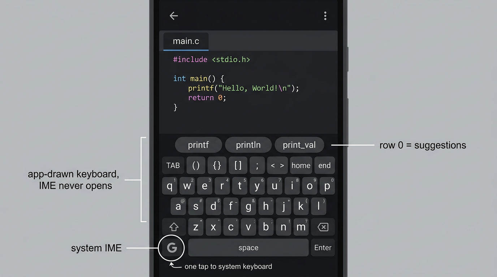

# CodeC Phase 28 — CodeC Keys: a dedicated in-app code keyboard

> **Status:** 🚧 **STARTED 2026-09-05 (owner: "Start phase 28") — 28.1 SPIKE
> BUILT on `arena/01a070ae-codec`, owner device round pending** (record:
> `PART_28_1_SPIKE.md` §4–§5). 28.2–28.4 remain PLANNED and gated: the README
> design law 3 holds — no layout work until the feel gate passes on the
> owner's device.
> Original feasibility note: **Status was** 📋 PLANNED — feasibility analysis
> complete, no code written. Owner question (2026-09-04): *"do you think if
> the app have it's own keyboard possible only for code nothing else and app
> dedicate not for every app?"* — **Answer: yes.** Details:
> `docs/EDITOR_MOBILE_RESEARCH.md` §9 (L0/L1/L2 layers, mechanisms, precedent,
> honesty table).
> **No PR/merge without the owner's explicit command.**



## What it is (and is not)

**CodeC Keys** is a keyboard the app **draws itself** inside the editor screen
— a normal Compose UI surface, not an Android IME service. It exists **only
inside CodeC** while the editor is focused; it cannot and will not be offered
to other apps (that would be layer L2 — explicitly out of scope).

```
┌────────────────────────────────────────────┐
│  editor (unchanged chrome: tabs/status)    │
├────────────────────────────────────────────┤
│ Row 0  ▶ suggestion strip (Phase 27 rides  │  ← completions stop
│          here) + ghost-accept "TAB ▸"      │    fighting the IME; WE
├────────────────────────────────────────────┤    own the thumb zone
│ Row 1  macros / context caps (per language)│
├────────────────────────────────────────────┤
│ Rows 2-4  code-QWERTY: letters + swipe-up  │
│  symbols/digits, full-size TAB, arrows,    │
│  HOME/END, DEL, ⏎, space —                 │
│  popups/swipe layers from 26.1's model     │
├────────────────────────────────────────────┤
│ 🔤 G-cap: summon SYSTEM IME for prose      │  ← escape hatch (law)
└────────────────────────────────────────────┘
```

Design law for this phase:
1. **Never a cage** — one tap summons the system IME, one tap dismisses back;
   CodeC Keys defaults ON but is a Settings choice, remembered.
2. **Same brain** — every cap produces an `EditorKey`/edit op through the pure
   host-tested model (26.1); the keyboard is *rendering + gestures*, zero new
   edit semantics.
3. **Feel is the gate** — 28.1 spikes latency/haptics first; if it doesn't feel
   instant on the owner's device, the phase stops and stays L0 (strip) forever.

| Part | Title | Cost | Effort |
|---|---|---|---|
| [28.1](PART_28_1_SPIKE.md) | IME-free input path spike (both cores) + feel gate | client-only | S |
| [28.2](PART_28_2_LAYOUT_ENGINE.md) | Data-driven keyboard: layout JSON, keycap model, rendering, gestures | client-only | M |
| [28.3](PART_28_3_SUGGESTIONS_ROW0.md) | Suggestions & ghost-accept as keyboard row 0 | client-only | S |
| [28.4](PART_28_4_ESCAPE_PARITY.md) | Prose escape hatch, TalkBack/HW parity, settings + opt-out | client-only | M |

Dependencies: **26.1** (keycap/popup/swipe model) required; **27.** rides on
top (28.3); **25** independent — the spike covers both candidate cores.
