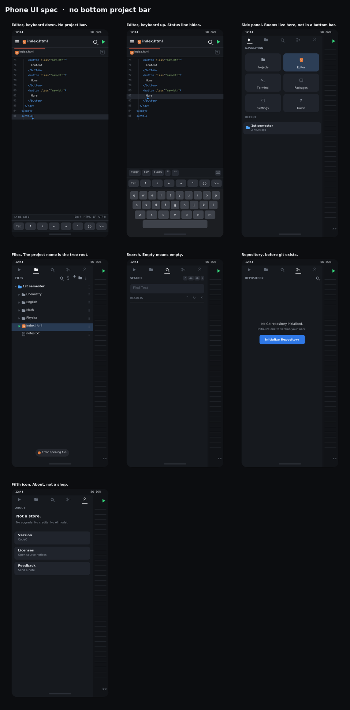
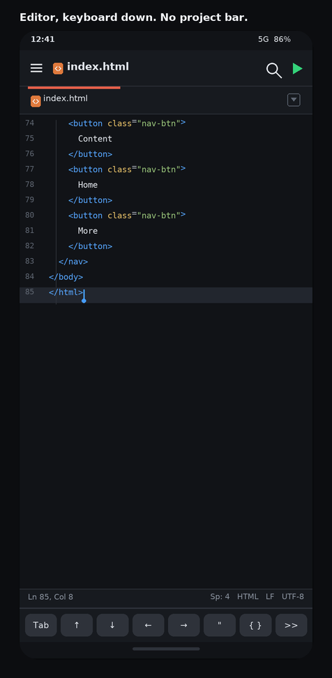
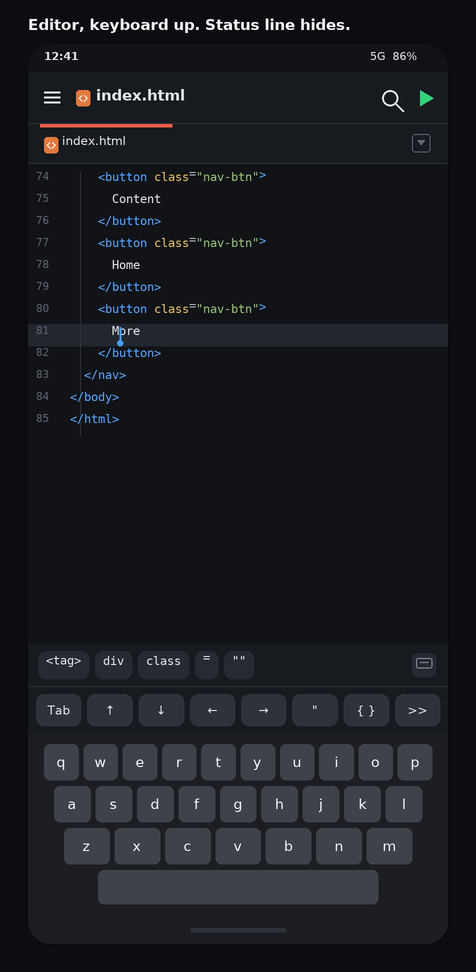
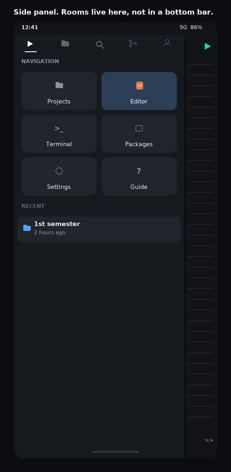
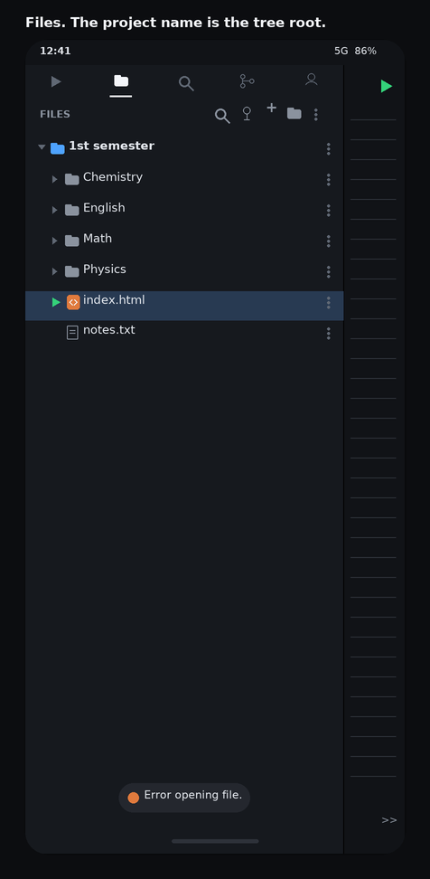
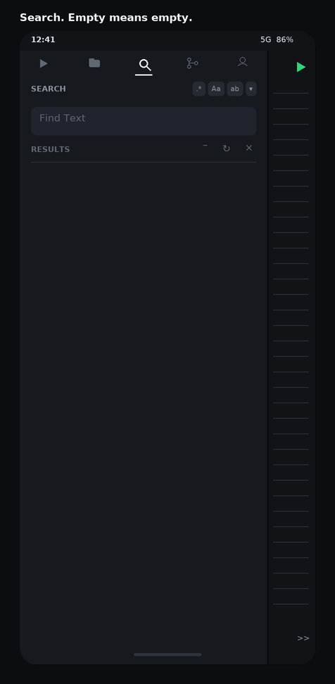
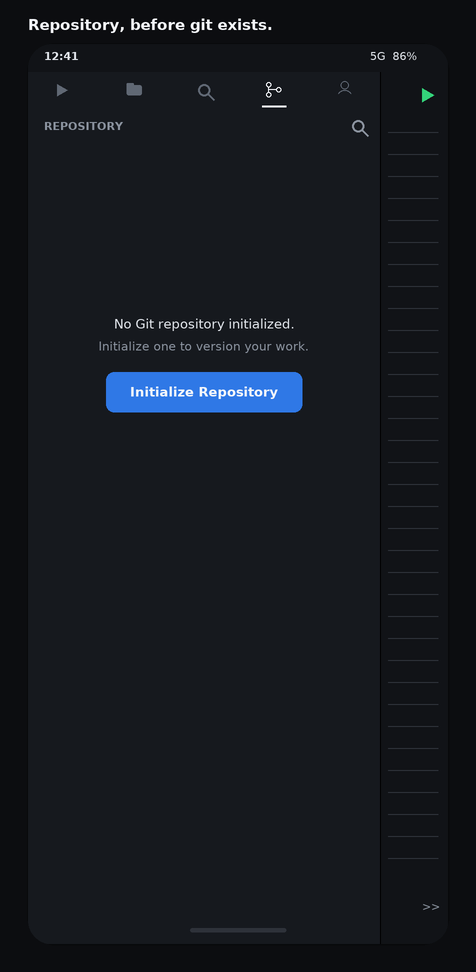
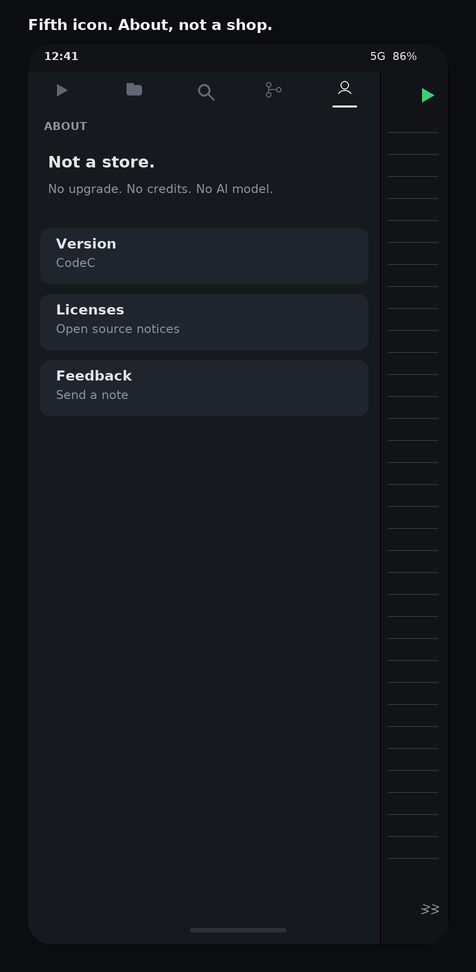
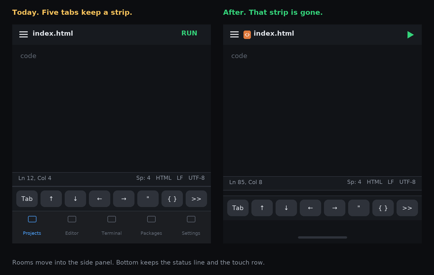

# Phone UI spec images

Drawings of the accepted phone chrome. Not photos, and not Play Store art.

The project bar does not get a strip at the bottom. Rooms live in the side panel. The bottom is the status line and the touch row, then the system keyboard when it is open.

Open `00-overview.png` first, then the numbered screens.

These are spec drawings, regenerated by `scripts/render_spck_ui.py`. The written review is `docs/SPCK_PHONE_UI_REPORT.md`.

The fifth icon opens About, not a shop. Say if that icon should open Settings instead.
